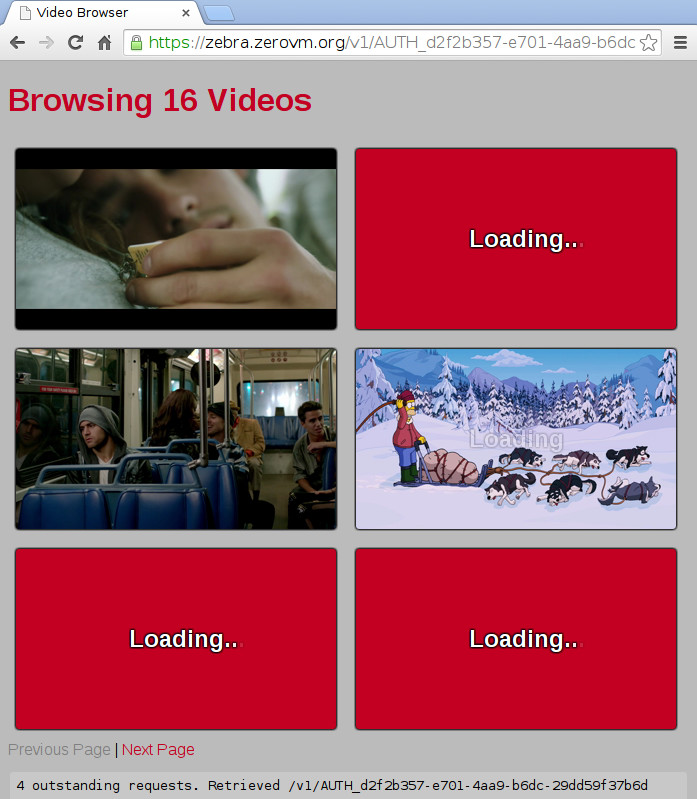
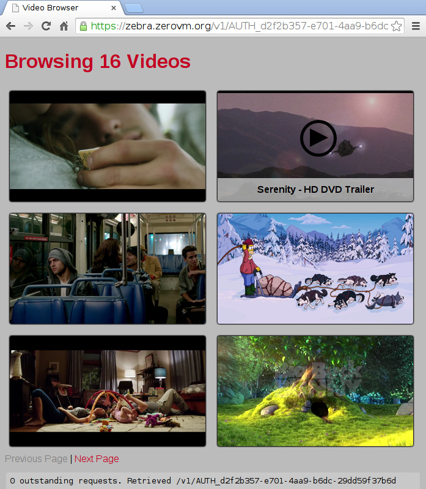
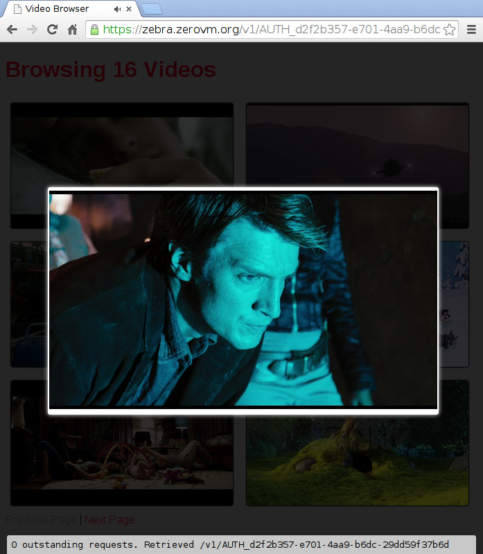

Screenshots
===========

Opening `index.html` will make the JavaScript code query Swift for all
the objects in the `videos` container. For each video, Swift is first
queried for the object's metadata. If a title is not found there, a
ZeroVM job is started to extract it. The same applies for the video
thumbnail: if a thumbnail URL is stored in Swift, this will be used
directly, otherwise a ZeroVM job is started to extract a single frame
30 seconds into the video:

Hovering on a video will show the title extracted from the Swift
metadata or from the video itself:

Clicking a thumbnail opens a HTML 5 video player when supported by the
browser. This is not really a ZeroVM specific feature, but it was easy
to add when the browser supports it:

